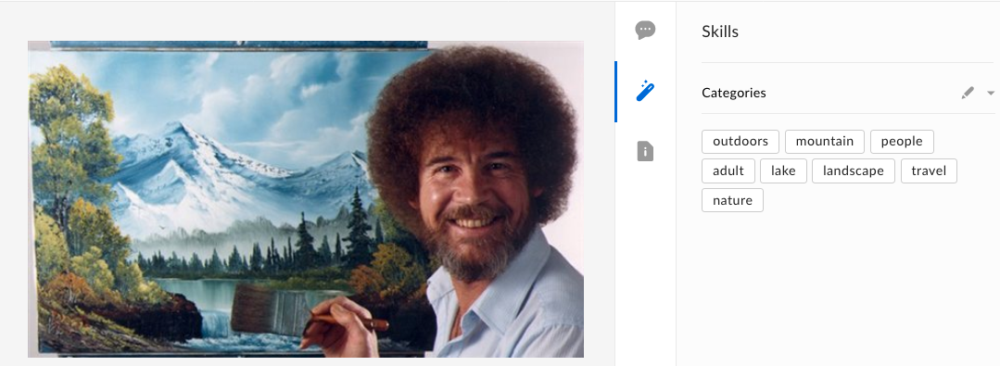

# Clarifai Image Categorization Skill

Use the [Clarifai API](https://clarifai.com/developer/) to automatically extract categorization information from image files and attach them to your files as metadata.

Clarifai is a machine learning system that is geared towards image categorization tasks. The prediction models used by Clarifai may be taught to identify key characteristics about images through the use of multiple samples.

## Usage

This sample may be deployed to any public hosting solution (e.g. Heroku, hosted site, etc.) that allows for Node to be run. 

### Prerequisites

  * Set up a new app with Clarifai and [obtain an API key](https://clarifai.com/developer/account/keys). Replace the temporary value for the Clarifai API key in config.js with this API key.
  * Set up a new Box Skills application on the folder that you would like to trigger events for. The invocation URL that you specify in the app should be the public URL for this sample, wherever it was deployed. 

